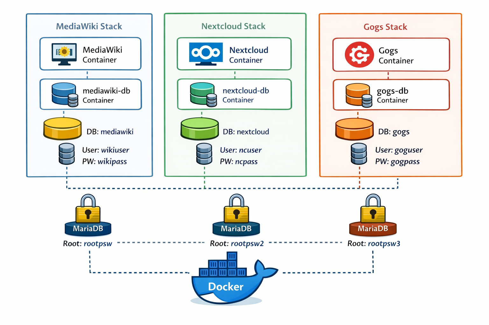
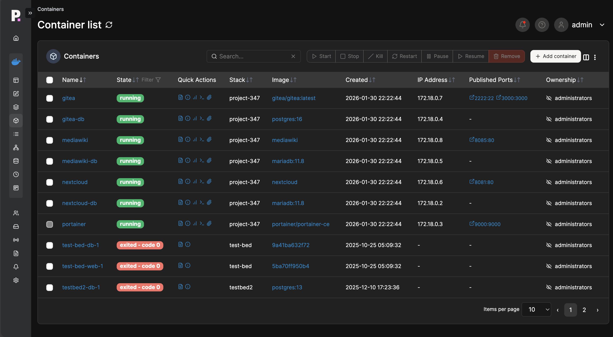
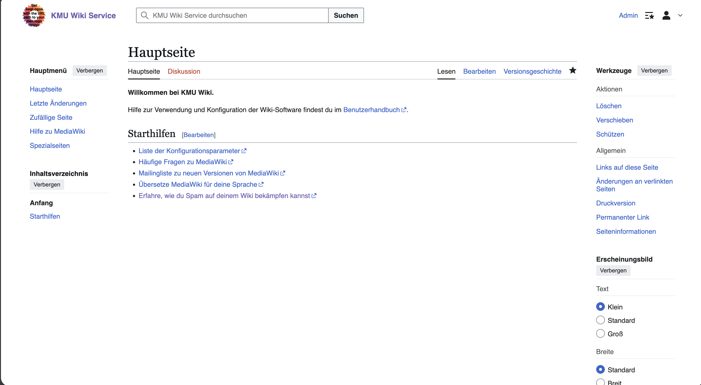
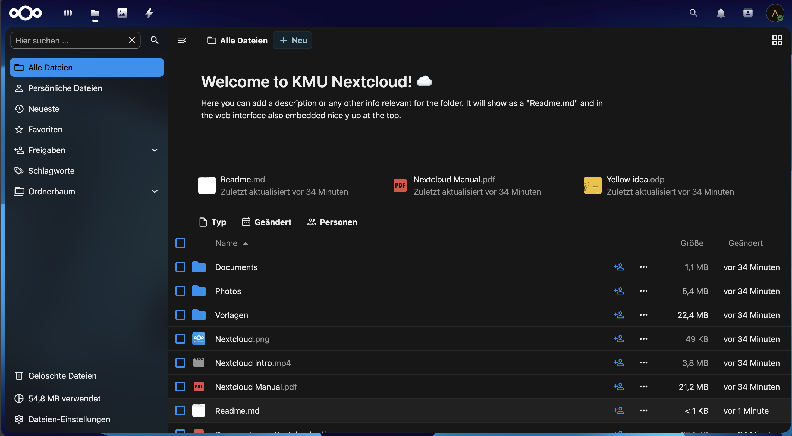
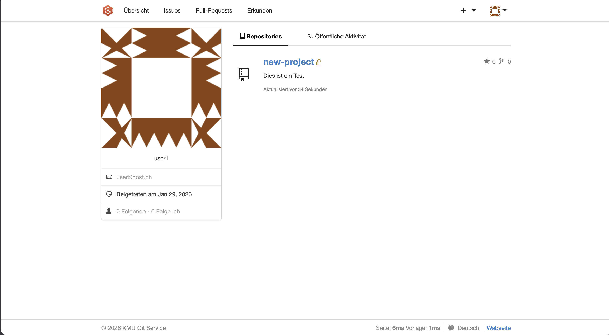

**Modul**: 347
**Projekt:** Microservice-Infrastruktur für ein Informatik-KMU
**Autor:** Jasmin Brawand
**Klasse:** UIFZ-2425-005
**Datum:** 28.01.2026

---
## Inhaltsverzeichnis

1. Einleitung
2. Informieren
3. Planen
4. Entscheiden
5. Realisieren
6. Testkonzept und Testprotokoll
7. Sicherheitskonzept
8. Auswertung / Reflexion
---
# 1. Einleitung

Im Rahmen dieses Projektes wurde für ein Informatik-KMU eine containerisierte Serverlösung mit mehreren Diensten realisiert. Ziel war es, mithilfe von Docker und docker-compose einen Microservice-basierten Applikationsstack aufzubauen, der firmeninterne Services wie Filesharing, Versionsverwaltung und ein Wiki bereitstellt.

Der Fokus lag dabei nicht nur auf der technischen Umsetzung, sondern auch auf einer sauberen Dokumentation, dem Einsatz von Versionsverwaltung sowie der Berücksichtigung von Sicherheits- und Testaspekten gemäss dem IPERKA-Modell.

---

# 2. Informieren

## 2.1 Ausgangslage

Das KMU benötigt mehrere interne Dienste, welche zentral, zuverlässig und wartbar betrieben werden sollen. Um eine flexible und skalierbare Lösung zu ermöglichen, sollen diese Dienste containerisiert umgesetzt werden.

---
## 2.2 Analyse der Anforderungen
Folgende Anforderungen wurden vom Auftraggeber definiert:

- Bereitstellung eines internen MediaWiki
- Einsatz von Nextcloud für Filesharing und Kollaboration
- Interne Versionsverwaltung mittels GitLab oder Gogs
- Persistente Speicherung aller Daten
- Überwachung der Container mittels Portainer
- Versionierung aller Konfigurationsdateien und der Dokumentation in Git

**Tabelle 1.1 - Funktionale Anforderungen in Tabellarischer Form**

| Dienst     | Beschreibung                | Port |
| ---------- | --------------------------- | ---- |
| MediaWiki  | Internes Firmen-Wiki        | 8085 |
| Nextcloud  | Filesharing & Kollaboration | 8081 |
| Git-Server | Versionsverwaltung          |      |
| Portainer  | Monitoring                  | 9000 |

---
## 2.3 Randbedingungen und Einschränkungen

- Betrieb auf einer virtuellen Maschine
- Begrenzte Ressourcen (RAM & Speicherplatz)
- Einsatz von Docker und docker-compose ist zwingend
- Alle Dienste müssen nach einem Neustart weiterhin funktionsfähig sein
- Die Lösung muss verständlich dokumentiert sein

---
## 2.4 Technische Vorabklärungen
Mögliche Technologien:

- Docker und docker-compose (gemäss Anforderungen vorgegeben)
- MariaDB, MySQL oder PostgreSQL als Datenbank für MediaWiki und Nextcloud
- Docker Volumes oder Bind Mounts
- Portainer zur grafischen Verwaltung und Überwachung der Container (gemäss Anforderungen vorgegeben)

---
## 2.5 Zielsetzung des Projekts
Das Ziel ist der Aufbau einer funktionsfähigen, dokumentierten und getesteten Docker-Infrastruktur, welche alle Anforderungen erfüllt und einen realitätsnahen Betrieb simuliert.

*Das Bild für die Systemübersicht wurde von der KI generiert*

---
# 3. Planen 

## 3.1 Vorgehensmodell
Die Umsetzung erfolgt nach dem IPERKA-Modell:
- Informieren
- Planen
- Entscheiden
- Realisieren
- Kontrollieren
- Auswerten

---
## 3.2 Arbeitsplanung

Das Projekt wurde im Zeitraum vom **09.01.2026 bis 30.01.2026** als Einzelarbeit durchgeführt. Die Arbeitsplanung orientierte sich am IPERKA-Modell und wurde zeitlich in einzelne Phasen unterteilt. Dadurch konnte eine strukturierte und zielgerichtete Umsetzung sichergestellt werden.

**Tabelle 3.1 – Zeitliche Arbeitsplanung nach IPERKA-Phasen**

|                     |                           |                                                                                                                      |
| ------------------- | ------------------------- | -------------------------------------------------------------------------------------------------------------------- |
| Zeitraum            | Phase                     | Tätigkeiten                                                                                                          |
| 09.01. – 10.01.2026 | Informieren               | Analyse der Projektanforderungen, Aufgabenstellung studieren und verstehen, erste Recherche auf Docker Hub zu Images |
| 11.01. – 13.01.2026 | Planen                    | Grobkonzept der Architektur, Definition der Services, Netzwerk- und Volumenplanung, Erstellung eines Zeitplans       |
| 14.01. – 16.01.2026 | Entscheiden               | Auswahl der Technologien, Festlegung der Container-Struktur und Ressourcenlimits                                     |
| 17.01. – 23.01.2026 | Realisieren               | Erstellung der docker-compose.yml, Aufbau der Container, Konfiguration von MediaWiki, Nextcloud, Gogs und Portainer  |
| 24.01. – 26.01.2026 | Testen                    | Durchführung der Funktionstests, Behebung von Fehlern (u. a. MariaDB-Initialisierung, Berechtigungen bei Nextcloud)  |
| 27.01. – 29.01.2026 | Kontrollieren / Auswerten | Überprüfung der Ergebnisse, Ergänzung der Dokumentation, Reflexion und Optimierungen                                 |
|30.01.2026|Abgabe|Abgabe des Projekts|
---

## 3.3 Testplanung
Für jeden Hauptdienst wurden Funktionstests definiert (siehe Kapitel 6)

---
# 4. Entscheiden

## 4.1 Auswahl Datenbank

**Tabelle 4.1 – Vergleich MairaDB & MySQL**

| Kriterium               | MariaDB                      | MySQL                 | PostgreSQL                   |
| ----------------------- | ---------------------------- | --------------------- | ---------------------------- |
| Unterstützung MediaWiki | Offiziell unterstützt        | Offiziell unterstützt | Unterstützt                  |
| Unterstützung Nextcloud | Offiziell unterstützt        | Offiziell unterstützt | Offiziell unterstützt        |
| Kompatibilität          | Sehr hoch (MySQL-kompatibel) | Hoch                  | Gut, aber abweichende Syntax |
| Ressourcenbedarf        | Niedrig bis mittel           | Mittel                | Mittel bis höher             |
| Docker-Unterstützung    | Sehr gut                     | Sehr gut              | Sehr gut                     |
| Konfigurationsaufwand   | Gering                       | Gering                | Etwas höher                  |
| Praxistauglichkeit      | Sehr hoch                    | Hoch                  | Hoch                         |

**Entscheidung**: MariaDB
**Begrünung**: Open Source, gute Performance, hohe Kompatibilität zu Nextcloud und MediaWiki.

---
## 4.2 Auswahl Git-Server

**Tabelle 4.2 – Vergleich Gitea & Gogs**

| Eigenschaft | Gogs | Gitea |
| ----------- | ---- | ----- |
| Entwicklung |	Eigenständig | Fork von Gogs |
| Ressourcennutzung |	Leichtgewichtig |	Etwas schwerer |
| Installation |	Einfach und schnell |	Einfach, aber umfangreicher |
| Funktionsumfang |	Grundlegende Features | Zusätzliche Features |
|Community |	Klein, aber aktiv |	Wachsende Community |
| Updates |	Regelmäßig, aber langsamer |	Häufiger und schneller |

**Entscheidung**: Gogs
**Begrünung**: Ressourcenarm und für KMU ausreichend.

---

## 4.3 Auswahl Persistenz

**Tabelle 4.3 – Vergleich Volumes & Bind Mounts**

| Eigenschaft | Docker Volumes | Bind Mounts |
| ----------- | ---- | ----- |
| Verwaltung |	Docker-CLI | Direkt auf Host |
| Isolation |	Unabhängig von Host |	Direkt gebunden |
| Datenpersistenz |	Empfohlen für dauerhafte Lösungen |	Entwicklungstests |
| Leistung |	Besser in vielen Umgebungen | Variabel |

**Entscheidung**: Volumes
**Begrünung**: besser für dauerhafte Lösungen, unabhängig von Host

---

# 5. Realisieren
## 5.1 Docker-Infrastruktur
Die Infrastruktur wurde mit docker-compose realisiert. Jeder Dienst läuft in einem eigenen Container und ist über ein gemeinsames Netzwerk verbunden.

---

## 5.2 Persistenz
Alle Dienste verwenden Docker Volumes zur persistenten Datenspeicherung.

---

## 5.3 Ressourcenbeschränkungen

- Datenbank-Container: max. 700 MB RAM
- Web-Container: max 300 MB RAM
- Portainer: max. 150 MB RAM

---

## 5.4 Sicherheit

- Passwörter sind im `.env`-file abgelegt
- Trennung der Dienste in Microservices

Was ich nicht einhalten konnte:
- Reduzierte Container Rechte konnte ich nicht umsetzten. Ich will mich aber darüber noch genauer Informieren und meine Präsentation über dieses Thema halten.

---

## 5.5 Probleme & Lösungen

Während der Umsetzung traten bei einzelnen Diensten typische Konfigurations- und Initialisierungsprobleme auf. Diese konnten durch Analyse der Logs, Anpassung der Docker-Konfiguration sowie erneute Initialisierung der Dienste behoben werden.

### Problem 1: MediaWiki – Endlosschleife nach Neustart

**Problem:**  
Nach der erfolgreichen Erstkonfiguration von MediaWiki und einem Neustart des Containers wurde die des Webbrowsers lediglich neu geladen. Dabei startete der Setup-Modus von MediaWiki neu und die Datei `LocalSettings.php` wurde neu generiert.

**Lösung:**  
Durch erneutes direktes Aufrufen von `http://localhost:8085` wurde die Installation korrekt abgeschlossen und MediaWiki konnte normal gestartet werden. Anschliessend blieb die Konfiguration auch nach weiteren Neustarts erhalten.

---

### Problem 2: Nextcloud – Daten nicht persistent gespeichert

**Problem:**  
Bei Nextcloud wurden hochgeladene Dateien und Konfigurationen nach einem Neustart des Containers nicht gespeichert. Ursache war ein fehlendes Volume für die Konfigurations- und Applikationsdaten.

**Lösung:**  
Es wurde ein zusätzliches Docker Volume für Nextcloud definiert und korrekt eingebunden. Dadurch konnten Konfigurationsdateien und Benutzerdaten persistent gespeichert werden und blieben auch nach Neustarts erhalten.

---

### Problem 3: Gogs – Benutzererstellung und Login nicht möglich

**Problem:**  
Die Login-Variablen für Gogs wurden initial im docker-compose-File definiert, jedoch wurde der entsprechende Benutzer in der Datenbank nicht automatisch angelegt. Eine manuelle Benutzererstellung über die Datenbank-Shell war zwar möglich, dennoch musste die webbasierte Ersteinrichtung durchgeführt werden. Nach Abschluss der Konfiguration war ein erneutes Erstellen eines Benutzers notwendig, da ein Login mit dem zuvor angelegten Benutzer nicht funktionierte.

**Teillösung / Erkenntnis:**  
Durch das Weitergeben der Login-Variablen auch an den Gogs-Webcontainer konnte die Benutzererstellung teilweise automatisiert werden. Dennoch ist bei Gogs eine manuelle Ersteinrichtung über die Weboberfläche zwingend erforderlich. Benutzerkonten müssen nach Abschluss dieser Ersteinrichtung neu erstellt werden, da vorher angelegte Benutzer nicht übernommen werden.

---

# 6. Testen
Die Tests wurden in einer kontrollierten Umgebung durchgeführt, welche dem geplanten Zielsystem möglichst nahekommt. Ziel war es, die Funktionalität, Stabilität und Persistenz der Docker-basierten Dienste zu überprüfen.

## 6.1 Testumgebung
- Virtuelle Maschine
- Docker Engine
- lokaler Browserzugriff

---

**Testzeil**: 
- Sicherstellung der Erreichbarkeit aller Dienste
- Überprüfung der Grundfunktionen (Login, Nutzung, Datenspeicherung)
- Kontrolle der Datenpersistenz nach Neustart

---
## 6.3 Testfälle

**Tabelle 6.1– Testfälle Portainer**

| Testfall | Beschreibung                | Erwartetes Ergebnis                                                                  | Ergebnis |
| -------- | --------------------------- | ------------------------------------------------------------------------------------ | -------- |
| T1       | Aufrufen der Weboberfläche  | Protainer ist über Port 9000 erreichbar                                              | OK       |
| T2       | Login mit Admin-User        | erfolgreiche Anmeldung                                                               | OK       |
| T3       | Containerübersicht anzeigen | Alle laufenden Container werden korrekt angezeigt                                    | OK       |
| T4       | Neustart                    | Container kann erfolgreich neugestartet werden, erneutes Login als Admin ist möglich | OK       |

**Tabelle 6.2– Testfälle Mediawiki**

| Testffall | Beschreibung              | Erwartetes Ergebnis                                                                                                 | Ergebnis |
| --------- | ------------------------- | ------------------------------------------------------------------------------------------------------------------- | -------- |
| T1        | Aufruf MediaWiki          | MediaWiki ist auf Port 8085 erreichbar                                                                              | OK       |
| T2        | Neue Wiki-Seite erstellen | Seite wird gespeichert und angezeigt                                                                                | OK       |
| T3        | Neustart Container        | Container kann erfolgreich neugestartet werden, erneutes Login ist möglich und erstellte Seiten sind noch vorhanden | OK       |

**Tabelle 6.2– Testfälle Nextcloud**

| Testffall | Beschreibung       | Erwartetes Ergebnis                                                                                        | Ergebnis |
| --------- | ------------------ | ---------------------------------------------------------------------------------------------------------- | -------- |
| T1        | Aufruf Nextcloud   | Nextcloud ist auf Port 8081 erreichbar                                                                     | OK       |
| T2        | Anmelden           | Erfolgreiche Anmeldung                                                                                     | OK       |
| T3        | Datei hochladen    | Datei kann hochgeladen werden                                                                              | OK       |
| T4        | Neustart Container | Container kann erfolgreich neugestartet werden, erneutes Login ist möglich und Dateien sind noch vorhanden | OK       |

**Tabelle 6.2– Testfälle Gogs**

| Testffall | Beschreibung         | Erwartetes Ergebnis                                                                                          | Ergebnis |
| --------- | -------------------- | ------------------------------------------------------------------------------------------------------------ | -------- |
| T1        | Aufruf Gogs          | Gogs ist auf Port 3000 erreichbar                                                                            | OK       |
| T2        | Anmelden             | Erfolgreiche Anmeldung                                                                                       | OK       |
| T3        | Repository erstellen | Repository wird erfolgreich angelegt                                                                         | OK       |
| T4        | Neustart Container   | Container kann erfolgreich neugestartet werden, erneutes Login ist möglich und Repository ist noch vorhanden | OK       |

---
# 7. Sicherheitskonzept

## 7.1 Schutzziele

Ziel des Sicherheitskonzepts ist es, den sicheren Betrieb der containerisierten Infrastruktur zu gewährleisten. Dabei orientiert sich das Konzept an den drei grundlegenden Schutzzielen der Informationssicherheit.

**Vertraulichkeit**  
Sensible Daten wie Benutzerkonten, Passwörter, Dateien und Konfigurationsinformationen sollen vor unbefugtem Zugriff geschützt werden.

**Integrität**  
Es muss sichergestellt werden, dass Daten und Konfigurationen nicht unbemerkt verändert oder manipuliert werden können.

**Verfügbarkeit**  
Alle Dienste sollen auch nach Neustarts oder kleineren Störungen weiterhin zuverlässig verfügbar sein.

---

## 7.2 Bedrohungen und Risiken

Beim Betrieb containerisierter Anwendungen bestehen verschiedene sicherheitsrelevante Risiken, welche im Rahmen dieses Projekts berücksichtigt wurden:

- Unsichere Speicherung von Zugangsdaten
    
- Fehlkonfiguration von Docker-Containern
    
- Zu hohe Rechte einzelner Container (Container Breakout)
    
- Datenverlust bei fehlender oder falscher Persistenz
    
- Öffentliche Erreichbarkeit interner Dienste
    

---

## 7.3 Umgesetzte Sicherheitsmassnahmen

Zur Reduktion der identifizierten Risiken wurden folgende Sicherheitsmassnahmen umgesetzt:

- Verwendung von `.env`-Dateien zur Auslagerung sensibler Zugangsdaten
    
- Ausschluss der `.env`-Datei aus der Versionsverwaltung mittels `.gitignore`
    
- Einsatz von Docker Volumes zur persistenten und sicheren Datenspeicherung
    
- Trennung der einzelnen Dienste in separate Container
    
- Nutzung eines internen Docker-Netzwerks zur Isolation der Services
    
- Einschränkung der Ressourcen (RAM) pro Container
    
- Verzicht auf unnötige Container-Rechte

---
# 8. Auswertung / Reflexion

Durch die Umsetzung dieses Projekts konnte ich umfassende praktische Erfahrungen im Aufbau und Betrieb einer containerisierten Microservice-Infrastruktur mit Docker sammeln. Besonders wertvoll war die Arbeit mit mehreren voneinander abhängigen Diensten sowie deren Zusammenspiel innerhalb einer gemeinsamen Docker-Umgebung.

Während der Realisierungs- und Testphase traten verschiedene praxisnahe Probleme auf. Dazu gehörten unter anderem Initialisierungsprobleme bei MariaDB, fehlende Persistenz bei Nextcloud sowie die komplexe Benutzer- und Ersteinrichtung von Gogs. Diese Herausforderungen zeigten deutlich, wie wichtig eine saubere Konfiguration von Volumes, Umgebungsvariablen und Initialisierungsabläufen ist.

Durch das systematische Analysieren von Logdateien, gezieltes Testen einzelner Komponenten und schrittweises Eingrenzen der Fehlerursachen konnten die meisten Probleme behoben werden. Dabei wurde mir bewusst, dass nicht alle Dienste vollständig automatisiert eingerichtet werden können und dass bei gewissen Applikationen – wie beispielsweise Gogs – eine manuelle Ersteinrichtung trotz vordefinierter Variablen notwendig bleibt.

Zusammenfassend hat mir dieses Projekt gezeigt, dass der Einsatz von Docker nicht nur technisches Wissen erfordert, sondern auch ein strukturiertes Vorgehen, Geduld bei der Fehlersuche und eine sorgfältige Dokumentation. Die gewonnenen Erkenntnisse sind praxisnah und lassen sich gut auf reale KMU-Umgebungen übertragen, insbesondere in Bezug auf Persistenz, Sicherheit und Wartbarkeit.